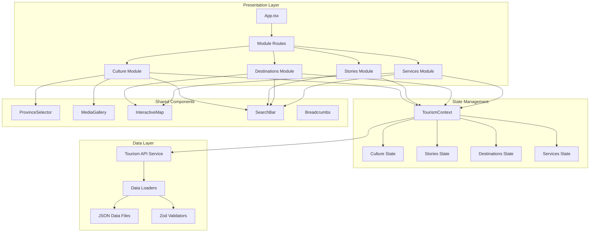

# Design Document: Cultural Tourism Modules

## Overview

This design document specifies the architecture and implementation details for four new cultural tourism modules in the Txopela Tour MVP application. These modules will enrich the tourist experience in Mozambique by providing comprehensive cultural, historical, destination, and service information organized by province and district.

### Modules

1. **Módulo de Cultura** - Cultural content per province (traditions, dances, gastronomy, events, photos, videos)
2. **Módulo de Histórias** - Stories and curiosities per locality (legends, historical facts, narratives)
3. **Módulo de Destinos** - Tourist destinations organized by location (photos, maps, descriptions, directions)
4. **Módulo de Serviços** - Services per province/district (hotels, restaurants, transport, guides)

### Design Goals

- **Seamless Integration**: Integrate naturally with existing app navigation patterns (sidebar on desktop, bottom nav on mobile)
- **Responsive Design**: Maintain consistent UX across mobile, tablet, and desktop devices
- **Performance**: Implement lazy loading, code splitting, and optimized media delivery
- **Accessibility**: Ensure WCAG 2.1 AA compliance with keyboard navigation and screen reader support
- **Maintainability**: Use TypeScript interfaces, Zod validation, and modular component architecture
- **Discoverability**: Enable cross-module navigation and contextual linking between related content

## Architecture

### High-Level Architecture



### Module Organization

Each module follows a consistent structure:

```
src/
├── modules/
│   ├── culture/
│   │   ├── pages/
│   │   │   ├── CultureHome.tsx
│   │   │   ├── ProvinceDetail.tsx
│   │   │   └── ContentDetail.tsx
│   │   ├── components/
│   │   │   ├── CultureCard.tsx
│   │   │   ├── TraditionSection.tsx
│   │   │   ├── DanceSection.tsx
│   │   │   └── GastronomySection.tsx
│   │   └── types.ts
│   ├── stories/
│   │   ├── pages/
│   │   │   ├── StoriesHome.tsx
│   │   │   ├── LocalityStories.tsx
│   │   │   └── StoryDetail.tsx
│   │   ├── components/
│   │   │   ├── StoryCard.tsx
│   │   │   ├── StoryFilter.tsx
│   │   │   └── StoryTimeline.tsx
│   │   └── types.ts
│   ├── destinations/
│   │   ├── pages/
│   │   │   ├── DestinationsHome.tsx
│   │   │   ├── DestinationsList.tsx
│   │   │   └── DestinationDetail.tsx
│   │   ├── components/
│   │   │   ├── DestinationCard.tsx
│   │   │   ├── DestinationMap.tsx
│   │   │   ├── DirectionsPanel.tsx
│   │   │   └── PhotoGallery.tsx
│   │   └── types.ts
│   └── services/
│       ├── pages/
│       │   ├── ServicesHome.tsx
│       │   ├── ServicesList.tsx
│       │   └── ServiceDetail.tsx
│       ├── components/
│       │   ├── ServiceCard.tsx
│       │   ├── ServiceMap.tsx
│       │   ├── ServiceFilter.tsx
│       │   └── ContactPanel.tsx
│       └── types.ts
├── context/
│   └── TourismContext.tsx
├── services/
│   └── tourismApi.ts
└── data/
    ├── culture/
    ├── stories/
    ├── destinations/
    └── services/
```

### Navigation Integration

The modules integrate into the existing navigation structure:

**Desktop (Sidebar)**:
- Add new navigation items below existing tabs
- Use consistent icon style and hover states
- Maintain 260px sidebar width

**Mobile (Bottom Nav)**:
- Add overflow menu for additional modules
- Use slide-up drawer for module selection
- Preserve existing tab behavior

## Components and Interfaces

### Core Data Models

#### Province and District Types

```typescript
// src/types/geography.ts
export type Province = 
  | 'maputo'
  | 'gaza'
  | 'inhambane'
  | 'sofala'
  | 'manica'
  | 'tete'
  | 'zambezia'
  | 'nampula'
  | 'niassa'
  | 'cabo-delgado'
  | 'maputo-cidade';

export interface ProvinceInfo {
  id: Province;
  name: string;
  capital: string;
  districts: string[];
  coordinates: {
    lat: number;
    lng: number;
  };
}

export interface District {
  id: string;
  name: string;
  province: Province;
  coordinates: {
    lat: number;
    lng: number;
  };
}
```

#### Culture Module Types

```typescript
// src/modules/culture/types.ts
export interface CulturalContent {
  id: string;
  province: Province;
  title: string;
  description: string;
  sections: {
    traditions?: TraditionSection;
    dances?: DanceSection;
    gastronomy?: GastronomySection;
    events?: EventSection;
  };
  media: {
    photos: MediaItem[];
    videos: MediaItem[];
  };
  createdAt: string;
  updatedAt: string;
}

export interface TraditionSection {
  title: string;
  description: string;
  items: TraditionItem[];
}

export interface TraditionItem {
  id: string;
  name: string;
  description: string;
  significance: string;
  images: string[];
  relatedStories?: string[]; // Story IDs
}

export interface DanceSection {
  title: string;
  description: string;
  dances: Dance[];
}

export interface Dance {
  id: string;
  name: string;
  description: string;
  origin: string;
  occasions: string[];
  videoUrl?: string;
  images: string[];
}

export interface GastronomySection {
  title: string;
  description: string;
  dishes: Dish[];
}

export interface Dish {
  id: string;
  name: string;
  description: string;
  ingredients: string[];
  preparation?: string;
  images: string[];
  relatedServices?: string[]; // Service IDs (restaurants)
}

export interface EventSection {
  title: string;
  description: string;
  events: CulturalEvent[];
}

export interface CulturalEvent {
  id: string;
  name: string;
  description: string;
  date?: string;
  frequency: 'annual' | 'monthly' | 'seasonal' | 'occasional';
  location?: string;
  images: string[];
}

export interface MediaItem {
  id: string;
  url: string;
  type: 'image' | 'video';
  caption?: string;
  credit?: string;
  thumbnail?: string;
}
```

#### Stories Module Types

```typescript
// src/modules/stories/types.ts
export type StoryType = 'legend' | 'historical-fact' | 'curiosity' | 'cultural-narrative';

export interface Story {
  id: string;
  title: string;
  type: StoryType;
  province: Province;
  district?: string;
  locality?: string;
  content: string;
  summary: string;
  period?: {
    start?: string;
    end?: string;
    description?: string;
  };
  relatedLocations?: string[]; // Destination IDs
  relatedCulture?: string[]; // Cultural content IDs
  images: string[];
  author?: string;
  sources?: string[];
  createdAt: string;
  updatedAt: string;
}

export interface StoryFilter {
  province?: Province;
  district?: string;
  type?: StoryType;
  searchQuery?: string;
}
```

#### Destinations Module Types

```typescript
// src/modules/destinations/types.ts
export type DestinationType = 
  | 'beach'
  | 'park'
  | 'monument'
  | 'museum'
  | 'natural-reserve'
  | 'historical-site'
  | 'viewpoint'
  | 'cultural-center';

export interface Destination {
  id: string;
  name: string;
  type: DestinationType;
  province: Province;
  district: string;
  location: {
    lat: number;
    lng: number;
    address: string;
  };
  summary: string;
  description: string;
  highlights: string[];
  photos: MediaItem[];
  directions: DirectionsInfo;
  accessibility: AccessibilityInfo;
  facilities: string[];
  bestTimeToVisit?: string;
  entryFee?: {
    local?: number;
    foreign?: number;
    currency: string;
  };
  openingHours?: {
    weekdays?: string;
    weekends?: string;
    notes?: string;
  };
  contacts?: ContactInfo;
  relatedStories?: string[]; // Story IDs
  relatedServices?: string[]; // Service IDs
  rating?: number;
  reviewsCount?: number;
  createdAt: string;
  updatedAt: string;
}

export interface DirectionsInfo {
  byRoad?: string;
  byPublicTransport?: string;
  byAir?: string;
  parking?: string;
  notes?: string;
}

export interface AccessibilityInfo {
  wheelchairAccessible: boolean;
  notes?: string;
}

export interface ContactInfo {
  phone?: string;
  email?: string;
  website?: string;
  socialMedia?: {
    facebook?: string;
    instagram?: string;
    twitter?: string;
  };
}
```

#### Services Module Types

```typescript
// src/modules/services/types.ts
export type ServiceCategory = 
  | 'hotel'
  | 'lodge'
  | 'restaurant'
  | 'transport'
  | 'tour-guide'
  | 'travel-agency'
  | 'car-rental';

export interface TouristService {
  id: string;
  name: string;
  category: ServiceCategory;
  province: Province;
  district: string;
  location: {
    lat: number;
    lng: number;
    address: string;
  };
  description: string;
  photos: MediaItem[];
  contacts: ContactInfo;
  openingHours?: {
    weekdays?: string;
    weekends?: string;
    notes?: string;
  };
  pricing?: PricingInfo;
  amenities?: string[];
  languages?: string[];
  rating?: number;
  reviewsCount?: number;
  verified: boolean;
  relatedDestinations?: string[]; // Destination IDs
  createdAt: string;
  updatedAt: string;
}

export interface PricingInfo {
  range: 'budget' | 'mid-range' | 'luxury';
  currency: string;
  details?: string;
  priceFrom?: number;
  priceTo?: number;
}

export interface ServiceFilter {
  province?: Province;
  district?: string;
  category?: ServiceCategory;
  priceRange?: 'budget' | 'mid-range' | 'luxury';
  rating?: number;
  searchQuery?: string;
}
```

### Shared Component Interfaces

#### Province Selector Component

```typescript
// src/components/shared/ProvinceSelector.tsx
interface ProvinceSelectorProps {
  selectedProvince?: Province;
  onProvinceSelect: (province: Province) => void;
  variant?: 'grid' | 'list' | 'map';
  showDistrictCount?: boolean;
}
```

#### Media Gallery Component

```typescript
// src/components/shared/MediaGallery.tsx
interface MediaGalleryProps {
  items: MediaItem[];
  onItemClick?: (item: MediaItem, index: number) => void;
  layout?: 'grid' | 'masonry' | 'carousel';
  columns?: number;
  showCaptions?: boolean;
  enableLightbox?: boolean;
}
```

#### Interactive Map Component

```typescript
// src/components/shared/InteractiveMap.tsx
interface InteractiveMapProps {
  center: { lat: number; lng: number };
  zoom?: number;
  markers: MapMarker[];
  onMarkerClick?: (marker: MapMarker) => void;
  clustering?: boolean;
  height?: string;
  showControls?: boolean;
}

interface MapMarker {
  id: string;
  position: { lat: number; lng: number };
  type: 'destination' | 'service';
  icon?: string;
  popup?: {
    title: string;
    description?: string;
    image?: string;
    link?: string;
  };
}
```

#### Search Bar Component

```typescript
// src/components/shared/SearchBar.tsx
interface SearchBarProps {
  placeholder?: string;
  onSearch: (query: string) => void;
  onSuggestionSelect?: (suggestion: SearchSuggestion) => void;
  showSuggestions?: boolean;
  filters?: SearchFilter[];
  debounceMs?: number;
}

interface SearchSuggestion {
  id: string;
  text: string;
  type: 'culture' | 'story' | 'destination' | 'service';
  province?: Province;
  icon?: string;
}

interface SearchFilter {
  id: string;
  label: string;
  type: 'select' | 'checkbox' | 'range';
  options?: { value: string; label: string }[];
}
```

#### Breadcrumbs Component

```typescript
// src/components/shared/Breadcrumbs.tsx
interface BreadcrumbsProps {
  items: BreadcrumbItem[];
  separator?: React.ReactNode;
  maxItems?: number;
}

interface BreadcrumbItem {
  label: string;
  href?: string;
  onClick?: () => void;
  icon?: React.ReactNode;
}
```

## Data Models

### Data Storage Structure

Data is organized in JSON files by module and province for easy maintenance:

```
src/data/
├── provinces.json          # Province metadata
├── districts.json          # District metadata
├── culture/
│   ├── maputo.json
│   ├── gaza.json
│   ├── inhambane.json
│   └── ...
├── stories/
│   ├── maputo.json
│   ├── gaza.json
│   └── ...
├── destinations/
│   ├── maputo.json
│   ├── gaza.json
│   └── ...
└── services/
    ├── maputo.json
    ├── gaza.json
    └── ...
```

### Zod Validation Schemas

```typescript
// src/schemas/tourism.ts
import { z } from 'zod';

export const ProvinceSchema = z.enum([
  'maputo',
  'gaza',
  'inhambane',
  'sofala',
  'manica',
  'tete',
  'zambezia',
  'nampula',
  'niassa',
  'cabo-delgado',
  'maputo-cidade',
]);

export const MediaItemSchema = z.object({
  id: z.string(),
  url: z.string().url(),
  type: z.enum(['image', 'video']),
  caption: z.string().optional(),
  credit: z.string().optional(),
  thumbnail: z.string().url().optional(),
});

export const CulturalContentSchema = z.object({
  id: z.string(),
  province: ProvinceSchema,
  title: z.string(),
  description: z.string(),
  sections: z.object({
    traditions: z.any().optional(),
    dances: z.any().optional(),
    gastronomy: z.any().optional(),
    events: z.any().optional(),
  }),
  media: z.object({
    photos: z.array(MediaItemSchema),
    videos: z.array(MediaItemSchema),
  }),
  createdAt: z.string(),
  updatedAt: z.string(),
});

export const StorySchema = z.object({
  id: z.string(),
  title: z.string(),
  type: z.enum(['legend', 'historical-fact', 'curiosity', 'cultural-narrative']),
  province: ProvinceSchema,
  district: z.string().optional(),
  locality: z.string().optional(),
  content: z.string(),
  summary: z.string(),
  period: z.object({
    start: z.string().optional(),
    end: z.string().optional(),
    description: z.string().optional(),
  }).optional(),
  relatedLocations: z.array(z.string()).optional(),
  relatedCulture: z.array(z.string()).optional(),
  images: z.array(z.string()),
  author: z.string().optional(),
  sources: z.array(z.string()).optional(),
  createdAt: z.string(),
  updatedAt: z.string(),
});

export const DestinationSchema = z.object({
  id: z.string(),
  name: z.string(),
  type: z.enum([
    'beach',
    'park',
    'monument',
    'museum',
    'natural-reserve',
    'historical-site',
    'viewpoint',
    'cultural-center',
  ]),
  province: ProvinceSchema,
  district: z.string(),
  location: z.object({
    lat: z.number(),
    lng: z.number(),
    address: z.string(),
  }),
  summary: z.string(),
  description: z.string(),
  highlights: z.array(z.string()),
  photos: z.array(MediaItemSchema),
  directions: z.object({
    byRoad: z.string().optional(),
    byPublicTransport: z.string().optional(),
    byAir: z.string().optional(),
    parking: z.string().optional(),
    notes: z.string().optional(),
  }),
  accessibility: z.object({
    wheelchairAccessible: z.boolean(),
    notes: z.string().optional(),
  }),
  facilities: z.array(z.string()),
  bestTimeToVisit: z.string().optional(),
  entryFee: z.object({
    local: z.number().optional(),
    foreign: z.number().optional(),
    currency: z.string(),
  }).optional(),
  openingHours: z.object({
    weekdays: z.string().optional(),
    weekends: z.string().optional(),
    notes: z.string().optional(),
  }).optional(),
  contacts: z.any().optional(),
  relatedStories: z.array(z.string()).optional(),
  relatedServices: z.array(z.string()).optional(),
  rating: z.number().optional(),
  reviewsCount: z.number().optional(),
  createdAt: z.string(),
  updatedAt: z.string(),
});

export const TouristServiceSchema = z.object({
  id: z.string(),
  name: z.string(),
  category: z.enum([
    'hotel',
    'lodge',
    'restaurant',
    'transport',
    'tour-guide',
    'travel-agency',
    'car-rental',
  ]),
  province: ProvinceSchema,
  district: z.string(),
  location: z.object({
    lat: z.number(),
    lng: z.number(),
    address: z.string(),
  }),
  description: z.string(),
  photos: z.array(MediaItemSchema),
  contacts: z.any(),
  openingHours: z.object({
    weekdays: z.string().optional(),
    weekends: z.string().optional(),
    notes: z.string().optional(),
  }).optional(),
  pricing: z.object({
    range: z.enum(['budget', 'mid-range', 'luxury']),
    currency: z.string(),
    details: z.string().optional(),
    priceFrom: z.number().optional(),
    priceTo: z.number().optional(),
  }).optional(),
  amenities: z.array(z.string()).optional(),
  languages: z.array(z.string()).optional(),
  rating: z.number().optional(),
  reviewsCount: z.number().optional(),
  verified: z.boolean(),
  relatedDestinations: z.array(z.string()).optional(),
  createdAt: z.string(),
  updatedAt: z.string(),
});
```

## Routing Structure

### Route Configuration

```typescript
// src/App.tsx - Add to existing routes
const tourismRoutes = [
  // Culture Module
  { path: '/cultura', element: <CultureHome /> },
  { path: '/cultura/:province', element: <ProvinceDetail /> },
  { path: '/cultura/:province/:contentId', element: <ContentDetail /> },
  
  // Stories Module
  { path: '/historias', element: <StoriesHome /> },
  { path: '/historias/:province', element: <LocalityStories /> },
  { path: '/historias/:province/:storyId', element: <StoryDetail /> },
  
  // Destinations Module
  { path: '/destinos', element: <DestinationsHome /> },
  { path: '/destinos/:province', element: <DestinationsList /> },
  { path: '/destinos/:province/:destinationId', element: <DestinationDetail /> },
  
  // Services Module
  { path: '/servicos', element: <ServicesHome /> },
  { path: '/servicos/:category', element: <ServicesList /> },
  { path: '/servicos/:category/:serviceId', element: <ServiceDetail /> },
];
```

### Navigation Menu Updates

```typescript
// Desktop Sidebar - Add after existing nav items
const tourismNavItems = [
  {
    tab: 'cultura' as const,
    label: 'Cultura',
    path: '/cultura',
    icon: (active: boolean) => (
      <svg width="18" height="18" viewBox="0 0 24 24" fill="none" 
           stroke={active ? '#0077B6' : '#64748B'} strokeWidth={active ? 2.2 : 1.8}>
        <path d="M12 2L2 7l10 5 10-5-10-5z"/>
        <path d="M2 17l10 5 10-5M2 12l10 5 10-5"/>
      </svg>
    ),
  },
  {
    tab: 'historias' as const,
    label: 'Histórias',
    path: '/historias',
    icon: (active: boolean) => (
      <svg width="18" height="18" viewBox="0 0 24 24" fill="none"
           stroke={active ? '#0077B6' : '#64748B'} strokeWidth={active ? 2.2 : 1.8}>
        <path d="M4 19.5A2.5 2.5 0 016.5 17H20"/>
        <path d="M6.5 2H20v20H6.5A2.5 2.5 0 014 19.5v-15A2.5 2.5 0 016.5 2z"/>
      </svg>
    ),
  },
  {
    tab: 'destinos' as const,
    label: 'Destinos',
    path: '/destinos',
    icon: (active: boolean) => (
      <svg width="18" height="18" viewBox="0 0 24 24" fill="none"
           stroke={active ? '#0077B6' : '#64748B'} strokeWidth={active ? 2.2 : 1.8}>
        <path d="M21 10c0 7-9 13-9 13s-9-6-9-13a9 9 0 0118 0z"/>
        <circle cx="12" cy="10" r="3"/>
      </svg>
    ),
  },
  {
    tab: 'servicos' as const,
    label: 'Serviços',
    path: '/servicos',
    icon: (active: boolean) => (
      <svg width="18" height="18" viewBox="0 0 24 24" fill="none"
           stroke={active ? '#0077B6' : '#64748B'} strokeWidth={active ? 2.2 : 1.8}>
        <rect x="3" y="3" width="7" height="7"/>
        <rect x="14" y="3" width="7" height="7"/>
        <rect x="14" y="14" width="7" height="7"/>
        <rect x="3" y="14" width="7" height="7"/>
      </svg>
    ),
  },
];
```

## Data Layer Design

### Tourism Context

```typescript
// src/context/TourismContext.tsx
import React, { createContext, useContext, useState, useEffect, useCallback } from 'react';
import { tourismApi } from '@/services/tourismApi';
import type { 
  CulturalContent, 
  Story, 
  Destination, 
  TouristService,
  Province 
} from '@/modules/types';

interface TourismContextType {
  // Culture
  cultureContent: CulturalContent[];
  selectedCulture: CulturalContent | null;
  fetchCultureByProvince: (province: Province) => Promise<void>;
  
  // Stories
  stories: Story[];
  selectedStory: Story | null;
  fetchStoriesByProvince: (province: Province) => Promise<void>;
  filterStories: (filter: StoryFilter) => Story[];
  
  // Destinations
  destinations: Destination[];
  selectedDestination: Destination | null;
  fetchDestinationsByProvince: (province: Province) => Promise<void>;
  filterDestinations: (filter: DestinationFilter) => Destination[];
  
  // Services
  services: TouristService[];
  selectedService: TouristService | null;
  fetchServicesByCategory: (category: ServiceCategory, province?: Province) => Promise<void>;
  filterServices: (filter: ServiceFilter) => TouristService[];
  
  // Search
  searchAll: (query: string) => Promise<SearchResults>;
  
  // State
  isLoading: boolean;
  error: string | null;
}

export function TourismProvider({ children }: { children: React.ReactNode }) {
  const [cultureContent, setCultureContent] = useState<CulturalContent[]>([]);
  const [stories, setStories] = useState<Story[]>([]);
  const [destinations, setDestinations] = useState<Destination[]>([]);
  const [services, setServices] = useState<TouristService[]>([]);
  const [isLoading, setIsLoading] = useState(false);
  const [error, setError] = useState<string | null>(null);

  // Implementation details...
  
  return (
    <TourismContext.Provider value={{ /* ... */ }}>
      {children}
    </TourismContext.Provider>
  );
}

export const useTourism = () => {
  const context = useContext(TourismContext);
  if (!context) {
    throw new Error('useTourism must be used within TourismProvider');
  }
  return context;
};
```

### Tourism API Service

```typescript
// src/services/tourismApi.ts
import { 
  CulturalContentSchema,
  StorySchema,
  DestinationSchema,
  TouristServiceSchema 
} from '@/schemas/tourism';
import type { Province } from '@/types/geography';

class TourismApiService {
  private baseUrl = '/data';

  async getCultureByProvince(province: Province) {
    try {
      const response = await fetch(`${this.baseUrl}/culture/${province}.json`);
      const data = await response.json();
      return CulturalContentSchema.parse(data);
    } catch (error) {
      console.error(`Failed to load culture data for ${province}:`, error);
      throw error;
    }
  }

  async getStoriesByProvince(province: Province) {
    try {
      const response = await fetch(`${this.baseUrl}/stories/${province}.json`);
      const data = await response.json();
      return z.array(StorySchema).parse(data);
    } catch (error) {
      console.error(`Failed to load stories for ${province}:`, error);
      throw error;
    }
  }

  async getDestinationsByProvince(province: Province) {
    try {
      const response = await fetch(`${this.baseUrl}/destinations/${province}.json`);
      const data = await response.json();
      return z.array(DestinationSchema).parse(data);
    } catch (error) {
      console.error(`Failed to load destinations for ${province}:`, error);
      throw error;
    }
  }

  async getServicesByProvince(province: Province) {
    try {
      const response = await fetch(`${this.baseUrl}/services/${province}.json`);
      const data = await response.json();
      return z.array(TouristServiceSchema).parse(data);
    } catch (error) {
      console.error(`Failed to load services for ${province}:`, error);
      throw error;
    }
  }

  async searchAll(query: string) {
    // Implement cross-module search
    const [culture, stories, destinations, services] = await Promise.all([
      this.searchCulture(query),
      this.searchStories(query),
      this.searchDestinations(query),
      this.searchServices(query),
    ]);

    return {
      culture,
      stories,
      destinations,
      services,
      total: culture.length + stories.length + destinations.length + services.length,
    };
  }

  private async searchCulture(query: string) {
    // Implementation
    return [];
  }

  private async searchStories(query: string) {
    // Implementation
    return [];
  }

  private async searchDestinations(query: string) {
    // Implementation
    return [];
  }

  private async searchServices(query: string) {
    // Implementation
    return [];
  }
}

export const tourismApi = new TourismApiService();
```

## Integration with Existing App

### App.tsx Updates

```typescript
// Add TourismProvider to provider hierarchy
function App() {
  return (
    <AuthProvider>
      <AppProvider>
        <TourismProvider>
          <Routes>
            {/* Existing routes */}
            <Route path="/auth/google/callback" element={<OAuthCallback />} />
            <Route path="/auth/github/callback" element={<OAuthCallback />} />
            
            {/* Tourism module routes */}
            <Route path="/cultura/*" element={<CultureRoutes />} />
            <Route path="/historias/*" element={<StoriesRoutes />} />
            <Route path="/destinos/*" element={<DestinationsRoutes />} />
            <Route path="/servicos/*" element={<ServicesRoutes />} />
            
            <Route path="*" element={<AppContent />} />
          </Routes>
        </TourismProvider>
      </AppProvider>
    </AuthProvider>
  );
}
```

### Sidebar Navigation Updates

```typescript
// Update sidebar navigation to include tourism modules
const navigationSections = [
  {
    title: 'Principal',
    items: [
      { tab: 'home', label: 'Início', icon: HomeIcon },
      { tab: 'map', label: 'Mapa', icon: MapIcon },
      { tab: 'explore', label: 'Favoritos', icon: HeartIcon },
      { tab: 'profile', label: 'Perfil', icon: UserIcon },
    ],
  },
  {
    title: 'Turismo',
    items: [
      { tab: 'cultura', label: 'Cultura', icon: CultureIcon },
      { tab: 'historias', label: 'Histórias', icon: BookIcon },
      { tab: 'destinos', label: 'Destinos', icon: MapPinIcon },
      { tab: 'servicos', label: 'Serviços', icon: GridIcon },
    ],
  },
];
```

### Mobile Bottom Nav Updates

```typescript
// Add overflow menu for tourism modules on mobile
const mobileNavItems = [
  { tab: 'home', label: 'Início', icon: HomeIcon },
  { tab: 'map', label: 'Mapa', icon: MapIcon },
  { tab: 'add', label: 'Adicionar', icon: PlusIcon },
  { tab: 'explore', label: 'Favoritos', icon: HeartIcon },
  { tab: 'more', label: 'Mais', icon: MoreIcon }, // Opens drawer with tourism modules
];
```


## Correctness Properties

*A property is a characteristic or behavior that should hold true across all valid executions of a system—essentially, a formal statement about what the system should do. Properties serve as the bridge between human-readable specifications and machine-verifiable correctness guarantees.*

### Property-Based Testing Applicability

After analyzing the requirements, this feature is **partially suitable** for property-based testing. The feature is primarily UI-focused with rendering, navigation, and integration with external libraries (Leaflet, React Router). However, there are specific areas where property-based testing provides value:

**Areas suitable for PBT:**
- **Filtering logic**: Stories, destinations, and services filtering
- **Data validation**: Zod schema validation
- **Search ranking**: Relevance-based ordering

**Areas NOT suitable for PBT:**
- UI rendering and layout (use snapshot tests)
- React Router integration (use integration tests)
- Leaflet map integration (use integration tests)
- Accessibility features (use axe-core and manual testing)
- Performance requirements (use performance tests)

### Property Reflection

Reviewing the identified properties from prework:

1. **Story filtering (2.4)** - Filter stories by type
2. **Destination filtering (3.4)** - Filter destinations by province, district, and type
3. **Service filtering (4.4)** - Filter services by category, province, and district
4. **Service filtering by criteria (4.7)** - Filter services by price, rating, availability
5. **Data validation (7.2)** - Zod schema validation
6. **Search result filtering (10.6)** - Filter search results by module, province, type
7. **Search ranking (10.7)** - Order results by relevance

**Redundancy Analysis:**
- Properties 1, 2, 3, 4, and 6 are all testing filtering logic with different data types
- These can be consolidated into a single comprehensive filtering property
- Property 5 (data validation) is unique and tests the validation layer
- Property 7 (search ranking) is unique and tests the ranking algorithm

**Final Properties:**
1. **Universal Filtering Property** - Consolidates 1, 2, 3, 4, 6
2. **Data Validation Property** - Property 5
3. **Search Ranking Property** - Property 7

### Property 1: Universal Filtering Correctness

*For any* collection of items (stories, destinations, services, or search results) and any filter criteria (type, province, district, category, price range, rating), applying the filter SHALL return only items that match ALL specified criteria, and SHALL return ALL items that match the criteria.

**Validates: Requirements 2.4, 3.4, 4.4, 4.7, 10.6**

**Rationale**: Filtering is a core operation across all modules. This property ensures that:
- No false positives: filtered results match the criteria
- No false negatives: all matching items are included
- Multiple criteria work correctly (AND logic)
- Empty filters return all items
- Impossible filters return empty results

**Test Strategy**: Generate random collections of typed data (stories, destinations, services) with varying attributes. Generate random filter combinations. Verify that:
1. Every returned item matches all filter criteria
2. Every item in the original collection that matches the criteria is in the results
3. The count of results is correct

### Property 2: Data Validation Correctness

*For any* data object, Zod schema validation SHALL accept the object if and only if it conforms to the schema specification, and SHALL provide descriptive error messages for non-conforming data.

**Validates: Requirements 7.2**

**Rationale**: Data validation is critical for maintaining data integrity. This property ensures that:
- Valid data always passes validation
- Invalid data always fails validation
- Error messages accurately describe validation failures
- Schema validation is consistent and deterministic

**Test Strategy**: Generate random valid and invalid data objects for each schema (CulturalContent, Story, Destination, TouristService). Verify that:
1. All valid objects pass validation
2. All invalid objects fail validation
3. Error messages contain relevant field names and constraint violations
4. Validation is deterministic (same input always produces same result)

### Property 3: Search Ranking Correctness

*For any* two search results A and B, if A has higher relevance score than B (based on title match, description match, and tag match), then A SHALL appear before B in the ordered results.

**Validates: Requirements 10.7**

**Rationale**: Search ranking determines user experience. This property ensures that:
- More relevant results appear first
- Ranking is transitive (if A > B and B > C, then A > C)
- Ranking is consistent for equal relevance scores
- Title matches rank higher than description matches
- Description matches rank higher than tag matches

**Test Strategy**: Generate random search results with varying relevance scores. Verify that:
1. Results are ordered by descending relevance
2. For any adjacent pair, the first has relevance >= the second
3. Title matches appear before description-only matches
4. Description matches appear before tag-only matches

## Error Handling

### Error Categories

1. **Data Loading Errors**
   - Missing JSON files
   - Malformed JSON
   - Network failures
   - Schema validation failures

2. **Navigation Errors**
   - Invalid routes
   - Missing route parameters
   - Deep link failures

3. **Map Integration Errors**
   - Leaflet initialization failures
   - Invalid coordinates
   - Tile loading failures

4. **User Input Errors**
   - Invalid search queries
   - Invalid filter combinations

### Error Handling Strategy

```typescript
// Data Loading Error Handling
async function loadProvinceData(province: Province, module: string) {
  try {
    const data = await tourismApi.getDataByProvince(province, module);
    return { data, error: null };
  } catch (error) {
    console.error(`Failed to load ${module} data for ${province}:`, error);
    
    // Log to error tracking service
    errorTracker.log({
      type: 'data_loading_error',
      module,
      province,
      error: error.message,
    });
    
    // Return fallback data
    return {
      data: getDefaultData(module),
      error: 'Não foi possível carregar os dados. Por favor, tente novamente.',
    };
  }
}

// Schema Validation Error Handling
function validateData<T>(data: unknown, schema: z.ZodSchema<T>): T | null {
  try {
    return schema.parse(data);
  } catch (error) {
    if (error instanceof z.ZodError) {
      console.error('Data validation failed:', error.errors);
      
      // Log validation errors
      errorTracker.log({
        type: 'validation_error',
        errors: error.errors,
      });
    }
    return null;
  }
}

// Map Error Handling
function initializeMap(containerId: string, options: MapOptions) {
  try {
    const map = L.map(containerId, options);
    L.tileLayer('https://{s}.tile.openstreetmap.org/{z}/{x}/{y}.png', {
      attribution: '© OpenStreetMap contributors',
    }).addTo(map);
    return { map, error: null };
  } catch (error) {
    console.error('Failed to initialize map:', error);
    return {
      map: null,
      error: 'Não foi possível carregar o mapa. Por favor, recarregue a página.',
    };
  }
}

// Navigation Error Handling
function handleNavigationError(error: Error) {
  console.error('Navigation error:', error);
  
  // Redirect to home or show error page
  if (error.message.includes('not found')) {
    return <NotFoundPage />;
  }
  
  return <ErrorPage message="Ocorreu um erro. Por favor, tente novamente." />;
}
```

### User-Facing Error Messages

All error messages should be:
- **In Portuguese**: Match the application language
- **User-friendly**: Avoid technical jargon
- **Actionable**: Suggest next steps when possible
- **Non-blocking**: Allow users to continue using other features

Examples:
- Data loading: "Não foi possível carregar os dados. Por favor, tente novamente."
- Network error: "Verifique sua conexão à internet e tente novamente."
- Not found: "Conteúdo não encontrado. Voltar para a página inicial."
- Map error: "Não foi possível carregar o mapa. Por favor, recarregue a página."

## Testing Strategy

### Testing Approach

This feature requires a **multi-layered testing strategy** combining different testing methodologies:

1. **Property-Based Tests** (for filtering, validation, ranking logic)
2. **Unit Tests** (for components, utilities, and UI logic)
3. **Integration Tests** (for routing, Leaflet integration, and cross-module navigation)
4. **Accessibility Tests** (for WCAG compliance)
5. **Visual Regression Tests** (for responsive design)
6. **Performance Tests** (for loading times and lazy loading)

### Property-Based Testing

**Library**: Use `fast-check` for TypeScript property-based testing

**Configuration**:
- Minimum 100 iterations per property test
- Each test tagged with feature name and property reference
- Tag format: `Feature: cultural-tourism-modules, Property {number}: {property_text}`

**Property Tests**:

```typescript
// Property 1: Universal Filtering Correctness
describe('Feature: cultural-tourism-modules, Property 1: Universal Filtering Correctness', () => {
  it('filters stories by type correctly', () => {
    fc.assert(
      fc.property(
        fc.array(storyArbitrary),
        fc.constantFrom('legend', 'historical-fact', 'curiosity', 'cultural-narrative'),
        (stories, filterType) => {
          const filtered = filterStories(stories, { type: filterType });
          
          // All results match the filter
          expect(filtered.every(s => s.type === filterType)).toBe(true);
          
          // All matching items are included
          const expected = stories.filter(s => s.type === filterType);
          expect(filtered.length).toBe(expected.length);
        }
      ),
      { numRuns: 100 }
    );
  });

  it('filters destinations by multiple criteria', () => {
    fc.assert(
      fc.property(
        fc.array(destinationArbitrary),
        provinceArbitrary,
        fc.string(),
        destinationTypeArbitrary,
        (destinations, province, district, type) => {
          const filtered = filterDestinations(destinations, {
            province,
            district,
            type,
          });
          
          // All results match all criteria
          expect(
            filtered.every(
              d =>
                d.province === province &&
                d.district === district &&
                d.type === type
            )
          ).toBe(true);
          
          // All matching items are included
          const expected = destinations.filter(
            d =>
              d.province === province &&
              d.district === district &&
              d.type === type
          );
          expect(filtered.length).toBe(expected.length);
        }
      ),
      { numRuns: 100 }
    );
  });

  it('filters services by price range and rating', () => {
    fc.assert(
      fc.property(
        fc.array(serviceArbitrary),
        fc.constantFrom('budget', 'mid-range', 'luxury'),
        fc.integer({ min: 1, max: 5 }),
        (services, priceRange, minRating) => {
          const filtered = filterServices(services, {
            priceRange,
            rating: minRating,
          });
          
          // All results match criteria
          expect(
            filtered.every(
              s =>
                s.pricing?.range === priceRange &&
                (s.rating ?? 0) >= minRating
            )
          ).toBe(true);
          
          // All matching items are included
          const expected = services.filter(
            s =>
              s.pricing?.range === priceRange &&
              (s.rating ?? 0) >= minRating
          );
          expect(filtered.length).toBe(expected.length);
        }
      ),
      { numRuns: 100 }
    );
  });
});

// Property 2: Data Validation Correctness
describe('Feature: cultural-tourism-modules, Property 2: Data Validation Correctness', () => {
  it('validates cultural content correctly', () => {
    fc.assert(
      fc.property(validCulturalContentArbitrary, (content) => {
        const result = CulturalContentSchema.safeParse(content);
        expect(result.success).toBe(true);
      }),
      { numRuns: 100 }
    );
  });

  it('rejects invalid cultural content', () => {
    fc.assert(
      fc.property(invalidCulturalContentArbitrary, (content) => {
        const result = CulturalContentSchema.safeParse(content);
        expect(result.success).toBe(false);
        if (!result.success) {
          expect(result.error.errors.length).toBeGreaterThan(0);
        }
      }),
      { numRuns: 100 }
    );
  });

  it('validates stories correctly', () => {
    fc.assert(
      fc.property(validStoryArbitrary, (story) => {
        const result = StorySchema.safeParse(story);
        expect(result.success).toBe(true);
      }),
      { numRuns: 100 }
    );
  });

  it('validates destinations correctly', () => {
    fc.assert(
      fc.property(validDestinationArbitrary, (destination) => {
        const result = DestinationSchema.safeParse(destination);
        expect(result.success).toBe(true);
      }),
      { numRuns: 100 }
    );
  });

  it('validates services correctly', () => {
    fc.assert(
      fc.property(validServiceArbitrary, (service) => {
        const result = TouristServiceSchema.safeParse(service);
        expect(result.success).toBe(true);
      }),
      { numRuns: 100 }
    );
  });
});

// Property 3: Search Ranking Correctness
describe('Feature: cultural-tourism-modules, Property 3: Search Ranking Correctness', () => {
  it('ranks search results by relevance', () => {
    fc.assert(
      fc.property(
        fc.array(searchResultArbitrary),
        fc.string(),
        (results, query) => {
          const ranked = rankSearchResults(results, query);
          
          // Results are ordered by descending relevance
          for (let i = 0; i < ranked.length - 1; i++) {
            const scoreA = calculateRelevance(ranked[i], query);
            const scoreB = calculateRelevance(ranked[i + 1], query);
            expect(scoreA).toBeGreaterThanOrEqual(scoreB);
          }
        }
      ),
      { numRuns: 100 }
    );
  });

  it('ranks title matches higher than description matches', () => {
    fc.assert(
      fc.property(fc.string({ minLength: 3 }), (query) => {
        const titleMatch = {
          id: '1',
          title: `Result with ${query}`,
          description: 'No match here',
          type: 'destination' as const,
        };
        const descMatch = {
          id: '2',
          title: 'No match here',
          description: `Result with ${query}`,
          type: 'destination' as const,
        };
        
        const ranked = rankSearchResults([descMatch, titleMatch], query);
        
        // Title match should come first
        expect(ranked[0].id).toBe('1');
        expect(ranked[1].id).toBe('2');
      }),
      { numRuns: 100 }
    );
  });
});
```

### Unit Tests

Unit tests focus on individual components and utilities:

```typescript
// Component Tests
describe('CultureCard', () => {
  it('renders cultural content correctly', () => {
    const content = mockCulturalContent();
    render(<CultureCard content={content} />);
    
    expect(screen.getByText(content.title)).toBeInTheDocument();
    expect(screen.getByText(content.description)).toBeInTheDocument();
  });

  it('displays media gallery when photos are available', () => {
    const content = mockCulturalContent({ photos: [mockPhoto()] });
    render(<CultureCard content={content} />);
    
    expect(screen.getByTestId('media-gallery')).toBeInTheDocument();
  });
});

describe('ProvinceSelector', () => {
  it('renders all provinces', () => {
    render(<ProvinceSelector onProvinceSelect={jest.fn()} />);
    
    const provinces = getAllProvinces();
    provinces.forEach(province => {
      expect(screen.getByText(province.name)).toBeInTheDocument();
    });
  });

  it('calls onProvinceSelect when province is clicked', () => {
    const onSelect = jest.fn();
    render(<ProvinceSelector onProvinceSelect={onSelect} />);
    
    fireEvent.click(screen.getByText('Maputo'));
    expect(onSelect).toHaveBeenCalledWith('maputo');
  });
});

// Utility Tests
describe('filterStories', () => {
  it('filters by type', () => {
    const stories = [
      mockStory({ type: 'legend' }),
      mockStory({ type: 'historical-fact' }),
      mockStory({ type: 'legend' }),
    ];
    
    const filtered = filterStories(stories, { type: 'legend' });
    expect(filtered).toHaveLength(2);
    expect(filtered.every(s => s.type === 'legend')).toBe(true);
  });

  it('filters by province', () => {
    const stories = [
      mockStory({ province: 'maputo' }),
      mockStory({ province: 'gaza' }),
      mockStory({ province: 'maputo' }),
    ];
    
    const filtered = filterStories(stories, { province: 'maputo' });
    expect(filtered).toHaveLength(2);
    expect(filtered.every(s => s.province === 'maputo')).toBe(true);
  });

  it('returns all stories when no filter is provided', () => {
    const stories = [mockStory(), mockStory(), mockStory()];
    const filtered = filterStories(stories, {});
    expect(filtered).toHaveLength(3);
  });
});
```

### Integration Tests

Integration tests verify routing, Leaflet integration, and cross-module navigation:

```typescript
describe('Culture Module Routing', () => {
  it('navigates to province detail', async () => {
    render(
      <MemoryRouter initialEntries={['/cultura']}>
        <CultureRoutes />
      </MemoryRouter>
    );
    
    fireEvent.click(screen.getByText('Maputo'));
    
    await waitFor(() => {
      expect(screen.getByTestId('province-detail')).toBeInTheDocument();
    });
  });

  it('preserves navigation history', async () => {
    const { container } = render(
      <MemoryRouter initialEntries={['/cultura']}>
        <CultureRoutes />
      </MemoryRouter>
    );
    
    // Navigate forward
    fireEvent.click(screen.getByText('Maputo'));
    await waitFor(() => {
      expect(screen.getByTestId('province-detail')).toBeInTheDocument();
    });
    
    // Navigate back
    fireEvent.click(screen.getByTestId('back-button'));
    await waitFor(() => {
      expect(screen.getByTestId('culture-home')).toBeInTheDocument();
    });
  });
});

describe('Leaflet Map Integration', () => {
  it('initializes map with correct center', () => {
    const destination = mockDestination({
      location: { lat: -25.9655, lng: 32.5832, address: 'Maputo' },
    });
    
    render(<DestinationMap destination={destination} />);
    
    const map = screen.getByTestId('leaflet-map');
    expect(map).toBeInTheDocument();
    
    // Verify map center (requires Leaflet testing utilities)
    const mapInstance = getLeafletMap(map);
    const center = mapInstance.getCenter();
    expect(center.lat).toBeCloseTo(-25.9655, 4);
    expect(center.lng).toBeCloseTo(32.5832, 4);
  });

  it('displays markers for multiple destinations', () => {
    const destinations = [
      mockDestination({ id: '1' }),
      mockDestination({ id: '2' }),
      mockDestination({ id: '3' }),
    ];
    
    render(<DestinationsMap destinations={destinations} />);
    
    const markers = screen.getAllByTestId('map-marker');
    expect(markers).toHaveLength(3);
  });
});

describe('Cross-Module Navigation', () => {
  it('navigates from story to related destination', async () => {
    const story = mockStory({
      relatedLocations: ['dest-1'],
    });
    
    render(
      <MemoryRouter>
        <TourismProvider>
          <StoryDetail story={story} />
        </TourismProvider>
      </MemoryRouter>
    );
    
    fireEvent.click(screen.getByText('Ver Destino'));
    
    await waitFor(() => {
      expect(window.location.pathname).toContain('/destinos');
    });
  });
});
```

### Accessibility Tests

```typescript
describe('Accessibility', () => {
  it('has no accessibility violations', async () => {
    const { container } = render(<CultureHome />);
    const results = await axe(container);
    expect(results).toHaveNoViolations();
  });

  it('supports keyboard navigation', () => {
    render(<ProvinceSelector onProvinceSelect={jest.fn()} />);
    
    const firstProvince = screen.getAllByRole('button')[0];
    firstProvince.focus();
    
    expect(firstProvince).toHaveFocus();
    
    fireEvent.keyDown(firstProvince, { key: 'Tab' });
    const secondProvince = screen.getAllByRole('button')[1];
    expect(secondProvince).toHaveFocus();
  });

  it('provides alt text for all images', () => {
    const content = mockCulturalContent({
      media: {
        photos: [mockPhoto({ caption: 'Traditional dance' })],
        videos: [],
      },
    });
    
    render(<CultureCard content={content} />);
    
    const images = screen.getAllByRole('img');
    images.forEach(img => {
      expect(img).toHaveAttribute('alt');
      expect(img.getAttribute('alt')).not.toBe('');
    });
  });
});
```

### Visual Regression Tests

Use tools like Percy or Chromatic for visual regression testing:

```typescript
describe('Visual Regression', () => {
  it('renders culture home correctly on desktop', async () => {
    const { container } = render(<CultureHome />);
    await percySnapshot('CultureHome - Desktop');
  });

  it('renders culture home correctly on mobile', async () => {
    viewport.set('mobile');
    const { container } = render(<CultureHome />);
    await percySnapshot('CultureHome - Mobile');
  });

  it('renders destination detail correctly', async () => {
    const destination = mockDestination();
    const { container } = render(<DestinationDetail destination={destination} />);
    await percySnapshot('DestinationDetail');
  });
});
```

### Performance Tests

```typescript
describe('Performance', () => {
  it('loads culture page in under 2 seconds', async () => {
    const startTime = performance.now();
    
    render(<CultureHome />);
    
    await waitFor(() => {
      expect(screen.getByTestId('culture-home')).toBeInTheDocument();
    });
    
    const loadTime = performance.now() - startTime;
    expect(loadTime).toBeLessThan(2000);
  });

  it('implements lazy loading for images', async () => {
    const content = mockCulturalContent({
      media: {
        photos: Array(20).fill(null).map(() => mockPhoto()),
        videos: [],
      },
    });
    
    render(<MediaGallery items={content.media.photos} />);
    
    // Only first few images should be loaded initially
    const images = screen.getAllByRole('img');
    const loadedImages = images.filter(img => img.getAttribute('src'));
    expect(loadedImages.length).toBeLessThan(images.length);
  });
});
```

### Test Coverage Goals

- **Unit Tests**: 80% code coverage
- **Integration Tests**: All critical user flows
- **Property Tests**: All filtering, validation, and ranking logic
- **Accessibility Tests**: All interactive components
- **Visual Regression**: All major pages and responsive breakpoints
- **Performance Tests**: All page loads and lazy loading scenarios

### Continuous Integration

All tests should run in CI pipeline:

```yaml
# .github/workflows/test.yml
name: Test

on: [push, pull_request]

jobs:
  test:
    runs-on: ubuntu-latest
    steps:
      - uses: actions/checkout@v2
      - uses: actions/setup-node@v2
        with:
          node-version: '18'
      - run: npm install
      - run: npm run test:unit
      - run: npm run test:integration
      - run: npm run test:property
      - run: npm run test:a11y
      - run: npm run test:performance
```


## Implementation Notes

### Development Phases

The implementation should follow these phases:

**Phase 1: Foundation (Week 1-2)**
- Set up module structure and routing
- Create TypeScript interfaces and Zod schemas
- Implement TourismContext and API service
- Create shared components (ProvinceSelector, Breadcrumbs, SearchBar)
- Set up data files structure

**Phase 2: Culture Module (Week 3)**
- Implement Culture pages (Home, ProvinceDetail, ContentDetail)
- Create Culture-specific components
- Implement media gallery with lazy loading
- Add navigation integration

**Phase 3: Stories Module (Week 4)**
- Implement Stories pages
- Create story filtering logic
- Implement story timeline component
- Add cross-module linking to destinations

**Phase 4: Destinations Module (Week 5)**
- Implement Destinations pages
- Integrate Leaflet maps
- Create photo gallery with lightbox
- Implement directions panel
- Add marker clustering

**Phase 5: Services Module (Week 6)**
- Implement Services pages
- Create service filtering logic
- Integrate maps for service locations
- Implement contact panel
- Add booking integration (if applicable)

**Phase 6: Search & Integration (Week 7)**
- Implement cross-module search
- Add search suggestions
- Implement search result ranking
- Add contextual navigation between modules
- Implement breadcrumbs

**Phase 7: Polish & Testing (Week 8)**
- Responsive design refinement
- Accessibility improvements
- Performance optimization
- Comprehensive testing
- Documentation

### Code Organization Best Practices

1. **Component Composition**: Break down complex components into smaller, reusable pieces
2. **Custom Hooks**: Extract common logic into custom hooks (useProvince, useFilter, useSearch)
3. **Type Safety**: Leverage TypeScript for compile-time safety
4. **Error Boundaries**: Wrap each module in error boundaries
5. **Lazy Loading**: Use React.lazy() for route-based code splitting
6. **Memoization**: Use React.memo, useMemo, and useCallback for performance

### Performance Optimization

```typescript
// Route-based code splitting
const CultureRoutes = React.lazy(() => import('@/modules/culture/routes'));
const StoriesRoutes = React.lazy(() => import('@/modules/stories/routes'));
const DestinationsRoutes = React.lazy(() => import('@/modules/destinations/routes'));
const ServicesRoutes = React.lazy(() => import('@/modules/services/routes'));

// Image optimization
function OptimizedImage({ src, alt, sizes }: ImageProps) {
  const srcSet = generateSrcSet(src, [320, 640, 960, 1280]);
  
  return (
    
  );
}

// Data prefetching
function useProvincePrefetch() {
  const { fetchCultureByProvince } = useTourism();
  
  const prefetch = useCallback((province: Province) => {
    // Prefetch on hover
    fetchCultureByProvince(province);
  }, [fetchCultureByProvince]);
  
  return prefetch;
}
```

### Accessibility Checklist

- [ ] All interactive elements are keyboard accessible
- [ ] Focus indicators are visible
- [ ] ARIA labels are provided for icon buttons
- [ ] Semantic HTML is used throughout
- [ ] Color contrast meets WCAG AA standards
- [ ] Images have descriptive alt text
- [ ] Forms have associated labels
- [ ] Error messages are announced to screen readers
- [ ] Skip links are provided for navigation
- [ ] Heading hierarchy is logical

### Responsive Design Breakpoints

```css
/* Mobile First Approach */
/* Base styles: Mobile (< 768px) */

/* Tablet */
@media (min-width: 768px) {
  /* Tablet-specific styles */
}

/* Desktop */
@media (min-width: 1024px) {
  /* Desktop-specific styles */
  /* Show sidebar navigation */
}

/* Large Desktop */
@media (min-width: 1440px) {
  /* Large screen optimizations */
}
```

### Data Management

**Initial Data Population**:
- Create sample data for at least 3 provinces
- Include diverse content types (traditions, dances, gastronomy, events)
- Provide high-quality images (optimized for web)
- Include realistic stories and destinations
- Add verified services with contact information

**Data Update Process**:
1. Update JSON files in `src/data/` directory
2. Validate data against Zod schemas
3. Test in development environment
4. Deploy updated data files
5. Clear browser cache if necessary

**Data Validation Script**:
```typescript
// scripts/validate-data.ts
import { readdirSync, readFileSync } from 'fs';
import { join } from 'path';
import { CulturalContentSchema, StorySchema, DestinationSchema, TouristServiceSchema } from '../src/schemas/tourism';

function validateDataFiles() {
  const dataDir = join(__dirname, '../src/data');
  const modules = ['culture', 'stories', 'destinations', 'services'];
  const schemas = {
    culture: CulturalContentSchema,
    stories: StorySchema,
    destinations: DestinationSchema,
    services: TouristServiceSchema,
  };
  
  let errors = 0;
  
  modules.forEach(module => {
    const moduleDir = join(dataDir, module);
    const files = readdirSync(moduleDir).filter(f => f.endsWith('.json'));
    
    files.forEach(file => {
      const filePath = join(moduleDir, file);
      const content = JSON.parse(readFileSync(filePath, 'utf-8'));
      
      try {
        schemas[module].parse(content);
        console.log(`✓ ${module}/${file}`);
      } catch (error) {
        console.error(`✗ ${module}/${file}:`, error.errors);
        errors++;
      }
    });
  });
  
  if (errors > 0) {
    console.error(`\n${errors} validation error(s) found`);
    process.exit(1);
  } else {
    console.log('\n✓ All data files are valid');
  }
}

validateDataFiles();
```

### Deployment Considerations

1. **Static Assets**: Optimize and compress images before deployment
2. **CDN**: Consider using CDN for image and video assets
3. **Caching**: Implement appropriate cache headers for static data
4. **Bundle Size**: Monitor bundle size and use code splitting
5. **Environment Variables**: Configure API endpoints and map tile URLs
6. **Error Tracking**: Integrate error tracking service (Sentry, LogRocket)
7. **Analytics**: Add analytics tracking for user behavior insights

### Future Enhancements

1. **User-Generated Content**: Allow users to submit stories and photos
2. **Offline Support**: Implement service worker for offline access
3. **Multi-Language Support**: Add English and other language translations
4. **Advanced Search**: Implement full-text search with Elasticsearch
5. **Personalization**: Recommend content based on user preferences
6. **Social Features**: Enable users to share and comment on content
7. **Booking Integration**: Direct booking for services
8. **AR Features**: Augmented reality for historical sites
9. **Audio Guides**: Audio narration for stories and destinations
10. **Interactive Maps**: 3D terrain and street view integration

## Summary

This design document provides a comprehensive blueprint for implementing four cultural tourism modules in the Txopela Tour MVP application. The design emphasizes:

- **Modular Architecture**: Each module is self-contained with clear interfaces
- **Type Safety**: TypeScript and Zod ensure data integrity
- **Responsive Design**: Seamless experience across all devices
- **Performance**: Lazy loading, code splitting, and optimized assets
- **Accessibility**: WCAG 2.1 AA compliance throughout
- **Testability**: Comprehensive testing strategy with property-based tests for core logic
- **Maintainability**: Clear code organization and documentation
- **Scalability**: Easy to add new provinces, content types, and features

The implementation follows React and TypeScript best practices, integrates smoothly with the existing application architecture, and provides a solid foundation for future enhancements.

### Key Deliverables

1. **4 Complete Modules**: Culture, Stories, Destinations, Services
2. **Shared Components**: ProvinceSelector, MediaGallery, InteractiveMap, SearchBar, Breadcrumbs
3. **Data Layer**: TourismContext, API service, Zod schemas
4. **Routing**: Integrated with React Router
5. **Navigation**: Desktop sidebar and mobile bottom nav updates
6. **Testing**: Property-based tests, unit tests, integration tests, accessibility tests
7. **Documentation**: Component documentation, API documentation, data structure documentation

### Success Criteria

- All 10 requirements are fully implemented
- All property-based tests pass with 100 iterations
- Unit test coverage > 80%
- All accessibility tests pass
- Page load times < 2 seconds on 3G
- Responsive design works on mobile, tablet, and desktop
- Cross-module navigation is seamless
- Search functionality returns relevant results
- Maps display correctly with clustering
- Data validation prevents invalid content

---

**Document Version**: 1.0  
**Last Updated**: 2024  
**Status**: Ready for Implementation
